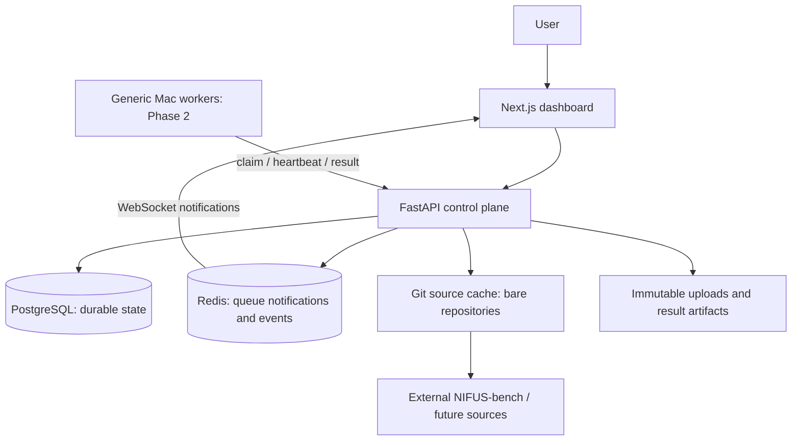
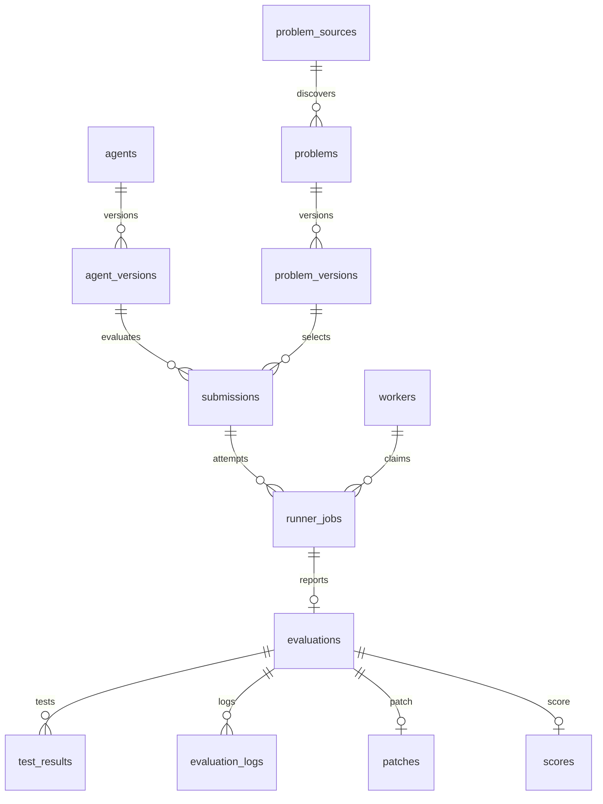

# Architecture

AgentBenchX separates the Windows control plane from generic Mac execution workers. This Phase 1 implementation is verified on Linux/WSL2 with Docker; Windows uses Docker Desktop Linux containers. The control plane never imports uploaded agents, runs benchmark test commands, builds benchmark Dockerfiles, or applies submitted patches.

The API uses dependency-injected sessions and application services: AgentManager, ProblemSourceManager, GitRepositoryManager, ProblemDiscoveryService, ProblemValidationService, EvaluationManager, CostCalculator and FailureAnalysisService. SQLAlchemy persists records; Alembic owns schema creation. Startup runs migrations, idempotently registers NIFUS Bench, then serves requests. Source sync is an explicit authenticated action.

Database tables: users, agents, agent_versions, problem_sources, problems, problem_versions, submissions, runner_jobs, workers, evaluations, test_results, evaluation_logs, patches, scores. Users is reserved for future multi-user identity; the current private-server model uses one environment-configured administrator credential, automatic worker registration without a bootstrap credential, and individually hashed worker tokens for subsequent worker operations.

The queue is deliberately hybrid: PostgreSQL is the durable job queue and atomic claim authority; Redis maintains a sorted notification index and distributes live events. A Redis outage cannot lose a job or permit a duplicate claim. Workers poll the API; the API selects the oldest queued row with `FOR UPDATE SKIP LOCKED`. Redis events are advisory and not a replay log. The browser reconciles every 15 seconds and after reconnects. This avoids unsafe dual-write dependence between PostgreSQL and Redis.

The schema supports multiple attempts per submission and future evaluation sets through an additional grouping relationship. No competition, billing or leaderboard entities are implemented. Categories describe tasks; they do not assign workers to specializations.
