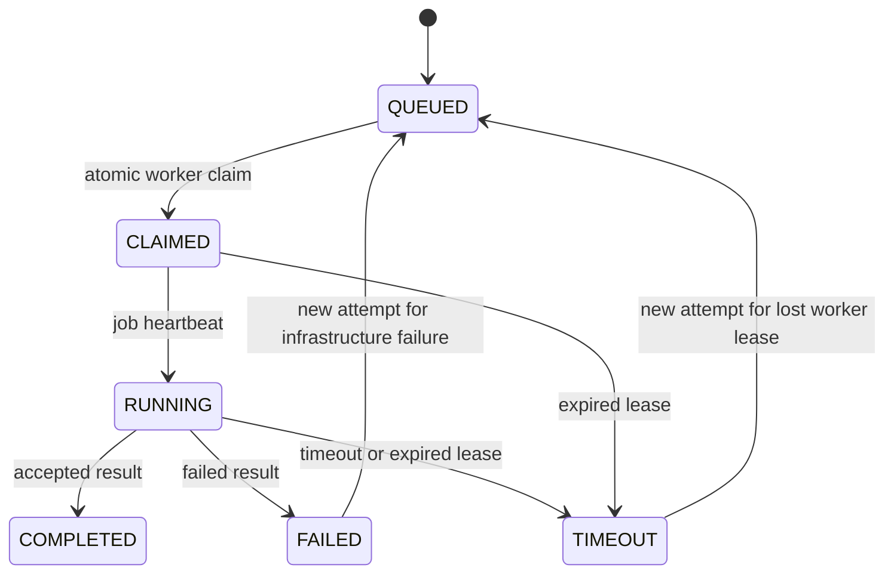

# Evaluation lifecycle and metrics

Upload `agent.py` into an Agent, then choose an immutable AgentVersion and one or more ProblemVersions. One Submission and initial RunnerJob are persisted per unique selected problem version in a database transaction. Agent uploads are limited to 2 MB, must be named agent.py, decode as UTF-8 and parse as Python syntax. They are never imported or run on the server. A locked Agent row serializes version numbers; each file gets its own UUID path and SHA-256 digest.

Submission and Evaluation are distinct: attempts each have a RunnerJob, and only reported attempts have Evaluation records. Reproducibility detail joins Evaluation → RunnerJob → Submission → AgentVersion/ProblemVersion and records worker and attempt. No historical record follows the mutable main branch implicitly.

Metrics include runtime_seconds, input_tokens, output_tokens, computed total_tokens, llm_cost, compute_cost, computed total_cost, tests_passed/failed/skipped, files_changed, insertions, deletions and score. Values must be finite and nonnegative. Tests are individual PASSED/FAILED/SKIPPED records. A COMPLETED result cannot contain failed tests or failure_type. Score is passed/(passed+failed); no executed tests yields zero. Costs are USD, with provider/model/rate details optionally captured in pricing_metadata. Phase 1 aggregates reported costs; it does not contact LLM providers or independently verify usage.

Dashboard completion/running/queued/failure counters use each submission's latest attempt. Runtime, tokens and cost count every reported attempt so retries do not hide spend. Average cost/runtime are per reported attempt. Success rate uses completed / finished submissions. Score averages available latest-attempt evaluations.

Artifacts are preserved for successes and failures under `storage/evaluations/<evaluation-id>/<problem-id>/`: agent_output.log, stdout.log, stderr.log, test_result.json, patch.diff, analysis.md. The database records logs, patch digest, score, metrics and artifact directory. Artifact reads are authenticated and restrict filenames to this fixed allowlist. Reports are evidence summaries, not AI diagnoses. Errors between filesystem writes and DB commit can leave orphan directories; retain them for investigation and add an age-based audited garbage collector later. Back up database and storage together.

ProblemVersion readiness describes validated source data and remains immutable. Execution state belongs to individual jobs, because one problem can be running in several independent submissions. The UI therefore shows READY on source versions and execution status on jobs/evaluations, rather than mutating a shared problem's global state.
