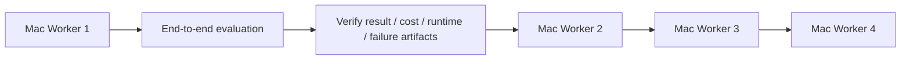

# Phase 1 engineering report

Verification date: 2026-09-14. Project root: `/home/administrator/RidgesProject/AgentBenchX`. The pre-existing empty AgentBenchX directory was used without a nested project directory; sibling projects were left unchanged.

## Delivered

| Area | Implementation |
|---|---|
| Structure | apps/api, apps/web, workers/evaluator, packages/schemas, problem_sources, storage, infrastructure, migrations, tests, docs, scripts |
| Architecture | Windows-compatible control plane; generic Mac execution contract; no central agent/benchmark execution |
| Stack | Python 3.12, FastAPI, Pydantic, SQLAlchemy, Alembic, PostgreSQL, Redis; Next.js 16.3.5, React 19, TypeScript, Tailwind 4 |
| Schema | All 14 requested core tables, foreign keys, version uniqueness and PostgreSQL immutability triggers |
| Agent flow | Create Agent → multipart agent.py upload → size/UTF-8/syntax validation → SHA-256 → immutable AgentVersion and file |
| Git sources | Validated SSH/HTTPS URLs, bare clone/fetch, branch resolution, full commit SHA, safe blob inspection, UUID caches, commit-retention refs |
| Discovery | Actual Harbor task.toml adapter; normalized categories, metadata validation, explicit GIS exclusion and persisted sync reports |
| Queue | Durable PostgreSQL jobs, Redis notifications, atomic SKIP LOCKED claims, per-worker serialization, lease fencing and bounded retries |
| Workers | Bootstrap registration, per-worker bearer credentials, availability/job heartbeats, claims, agent download and idempotent result collection |
| Results | Distinct submission/job/evaluation records, individual tests, logs, patch hashes, scores and traceability joins |
| Metrics | Runtime, tokens, provider-neutral USD costs, tests, patch size and score; computed totals and dashboard aggregation |
| Failure artifacts | Fixed-name files under evaluation/problem UUID directories; authenticated access; basic evidence reports |
| Live events | Redis Pub/Sub → authenticated WebSocket; event-triggered REST refresh plus 15-second fallback polling |
| UI | All ten requested routes, source sync, agent creation/upload, problem selection, worker pool, dashboard, result and failure-artifact views |
| Documentation | Architecture/ER/sequence/state Mermaid diagrams, setup, environment, SSH, worker protocol, security and scaling plan |

## API coverage

- Health: GET `/api/v1/health`.
- Agents: GET/POST `/agents`; GET `/agents/{id}`; GET/POST `/agents/{id}/versions`.
- Sources: GET/POST `/problem-sources`; GET `/problem-sources/{id}`; POST `/problem-sources/{id}/sync`.
- Problems: GET `/problems`, `/problems/{id}`, `/problems/{id}/versions`.
- Submissions: GET/POST `/submissions`; GET `/submissions/{id}`.
- Workers: GET `/workers`, `/workers/{id}`; POST `/workers/register`, `/workers/{id}/heartbeat`, `/workers/{id}/jobs/claim`, `/workers/{id}/jobs/{job_id}/heartbeat`, `/workers/{id}/jobs/{job_id}/result`; GET lease-bound `/workers/{id}/jobs/{job_id}/agent`.
- Evaluations: GET `/evaluations`, `/evaluations/{id}`, `/evaluations/{id}/artifacts/{name}`.
- Operations: GET `/jobs`, `/jobs/{id}`, `/dashboard`; WebSocket `/events`.

All paths after the first use `/api/v1`. Pydantic request and public record response models generate `packages/schemas/openapi.json`; `/docs` provides interactive documentation. Core business operations live in service modules.

## Actual source verification

The requested SSH remote cloned and fetched successfully using server credentials outside the restricted tool network. The initial restricted attempt encountered a system SSH configuration permission issue and DNS restriction; the authorized retry succeeded. No credentials were printed or copied to workers.

Repository: `git@github.com:wongfengchen8-cell/NIFUS-bench.git`.
Branch: `main`.
Commit: `55014c032f9532834cccc780f4d372c90ebcb37f`.
Result: **29 supported problems persisted with 29 immutable ProblemVersions (21 CODING, 8 DATABASE); 17 GIS tasks excluded.** Details: [source-inspection.json](source-inspection.json). Repeat synchronization at an unchanged commit creates zero additional versions.

## Verification results

| Check | Result |
|---|---|
| PostgreSQL starts | PASS: PostgreSQL 17 Compose container healthy on local port 55432 |
| Redis starts | PASS: Redis 7 Compose container healthy on local port 56379 |
| Alembic migrations | PASS: table migration + immutable-version guards applied; `alembic check` reports no drift |
| FastAPI process | PASS: native process listening on 127.0.0.1:8000 |
| Health | PASS: HTTP 200, database=true, redis=true |
| Next.js production build | PASS: Webpack compile, TypeScript and route generation |
| Next.js process/routes | PASS: dashboard, agents, sources, problems, workers and evaluations return HTTP 200 on port 3000 |
| Real Git integration | PASS: SSH clone/fetch, branch/commit resolution, blob discovery and database version creation |
| Upload and versions | PASS: integration tests verify syntax/size/name checks, hashes, numbering and no execution |
| Worker protocol/jobs | PASS: registration, auth, heartbeat, creation, concurrent claims, expiry/retry fencing, draining and result idempotency |
| Live events | PASS: authenticated API WebSocket and real Redis event delivery through Next.js WebSocket proxy |
| Failure artifacts/metrics | PASS: round-trip test results, logs, patch, basic report, totals and traceability |
| Tests | **23 passed** with actual PostgreSQL/Redis and opt-in real NIFUS inspection; two upstream test-client deprecation warnings |
| Browser rendering | PASS: Chromium login, live indicator, all main pages, 29 problem rows, problem detail, no JavaScript errors, and no horizontal overflow at 390px mobile width |
| Static checks | PASS: Ruff and TypeScript no-emit |
| Complete Compose API/web image build | **BLOCKED by environment:** Debian package downloads refused over HTTP and HTTPS, including host build networking |

Browser screenshots are retained locally in `storage/dashboard-desktop.png` and `storage/dashboard-mobile.png`. Chromium required one missing shared library, downloaded and extracted under /tmp without installing system packages.

The tests use temporary PostgreSQL schemas, actual migrations, mocked/local Git fixtures and separately enabled real-source inspection. Concurrency testing uses one application lifespan shared by simultaneous clients; an earlier harness race was fixed rather than ignored. No successful real agent execution or Mac worker result is claimed.

## Environment and limits

Inspected Linux/WSL2, Python 3.14 system installation plus Python 3.12.10 used for the project, Node 22.23.2, npm 10.9.8, Git 2.53.0, Docker 29.1.3, Compose 2.40.3, PostgreSQL and Redis executables. The unqualified `python` command was not configured; project commands use the explicit .venv interpreter.

Docker daemon access and networked verification required tool approval. Two approval-review requests timed out and succeeded on their permitted retries; the timeouts did not identify unsafe actions. Default Turbopack hit process/socket restrictions; the supported Webpack builder completed successfully. Complete Docker image verification remains limited by network egress, not marked as a passing check. Native API/web processes plus Docker PostgreSQL/Redis were used for live verification.

Remaining scope: no actual Mac execution, LLM calls, production sandbox, AI diagnosis, leaderboards, competitions, billing or GIS. Costs are worker-reported; Phase 2 must capture authoritative usage and image/dependency digests. Historical Git/agent identity is fixed, but upstream image/package dependencies are not yet independently locked. Production identity, credential rotation/revocation, rate limiting, TLS ingress, background source sync, large-library pagination UI and artifact retention/garbage collection remain future work. Redis events are transient; REST reconciliation is the recovery path. Lease fencing cannot terminate a disconnected worker; the worker must enforce lease-loss shutdown.

## Exact Phase 2 plan

1. Connect **Mac Worker #1** with the generic client and its own least-privilege source access. Persist its individual worker identity.
2. Implement a real disposable sandbox, Harbor environment preparation, the agent_main adapter, checksum verification, verifier/solution separation, bounded resources and a lease-loss kill watchdog. Never add a host execution fallback.
3. Run **one end-to-end evaluation** from uploaded AgentVersion and immutable ProblemVersion through claim, sandbox execution, tests, patch capture and result acknowledgment.
4. **Verify result, cost, runtime and failure artifacts**, including one deliberate agent/test failure and one lost-heartbeat case. Capture image digests and provider-neutral usage evidence.
5. Add **Mac Worker #2**, then **Mac Worker #3**, then **Mac Worker #4**, running the exact same implementation. Verify fair dynamic claims and no duplicate active assignments across the shared queue.

