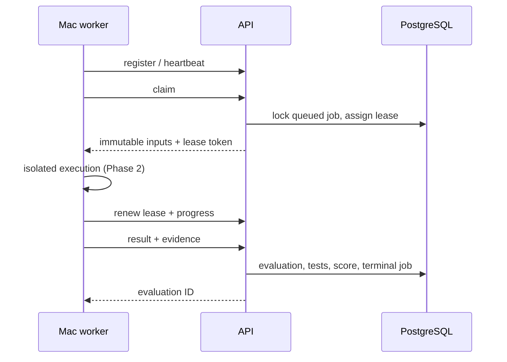

# Worker protocol, version 0.1

Phase 1 supplies the control-plane API. Phase 2 adds the Mac-only loop and Docker implementation under `workers/evaluator/`, reusing this protocol. See [Mac Worker #1 runbook](mac-worker-1.md); real Mac verification is tracked separately in [phase2-verification.md](phase2-verification.md).

1. Automatically register on first connection with `POST /api/v1/workers/register`; no Authorization header or manual approval is required on the existing trusted private network. Body: name, hostname, platform, version, capabilities. Store the returned ID and unique token securely. Only its SHA-256 hash is retained server-side. Registration creates an identity; reconnect using the persisted identity instead of registering repeatedly.
2. Use the individual worker bearer token for every subsequent worker endpoint. Send `POST /workers/{id}/heartbeat` with status ONLINE, DRAINING, ERROR or OFFLINE. The server reports BUSY while a job is active. Worker availability and job execution leases have separate heartbeats.
3. `POST /workers/{id}/jobs/claim` returns a job or JSON null when empty. Claims serialize per worker and use PostgreSQL `SKIP LOCKED` across workers. A worker cannot claim a second active job. Any generic online worker may claim the next task.
4. The payload contains `id`, `submission_id`, `attempt`, `lease_token`, `lease_seconds`, the exact `problem_version`, and the `agent_version` SHA-256. Download the agent via `agent_download_url` with the worker bearer and `X-Lease-Token`. Verify its digest. No SSH key or provider secret is included.
5. Fetch the exact commit with worker-owned access, prepare a disposable sandbox and follow Harbor layout (`/tests/test.sh`, repository environment and instruction). Do not expose reference solutions or verifier files to the agent. Agent ABI inspected in NIFUS-bench is `agent_main(input: dict) -> str`, returning a unified diff; implementing its full input adapter belongs to Phase 2.
6. Send a job heartbeat every 20–30 seconds to `POST /workers/{id}/jobs/{job_id}/heartbeat`, with `lease_token` and one of job.started, agent.started, agent.finished, test.started, test.progress, test.finished. The default lease is 120 seconds. A job heartbeat advances CLAIMED to RUNNING and renews the lease.
7. Report a terminal result to `POST /workers/{id}/jobs/{job_id}/result`. Include lease_token, COMPLETED/FAILED/TIMEOUT, failure_type when applicable, metrics, tests, stdout, stderr, agent_output and patch. The portable schema is `packages/schemas/openapi.json`. Repeating a successfully accepted report returns the same evaluation; first accepted result wins.
8. Destroy the sandbox and workspace in a finally block. Keep local result evidence until the server acknowledges receipt.

Lease expiry marks the attempt TIMEOUT and creates a new queued job, up to three attempts. Infrastructure failure results also retry up to that limit. Test, agent and security failures do not automatically retry. Stale heartbeats/results are rejected. An expired attempt with no received result has a job error, not a fabricated evaluation. The dashboard includes this terminal job state.

**Worker requirement:** stop/kill local execution before lease expiry if renewal fails. A server lease fences accepted results, but cannot physically kill a disconnected computer. Phase 2 must implement this fail-closed watchdog before execution is enabled. TIMEOUT worker results need failure_type TIMEOUT. Costs are worker-reported in USD with provider-neutral pricing_metadata. Omitted/unavailable tokens and costs are now null; totals remain null if a component is unknown. Optional execution evidence includes agent/test exit codes and timestamps and image ID, persisted within the existing metrics JSON. Billing reconciliation is out of scope.

HTTP semantics: 201 creates records, 200 returns claims/results, 401 missing authentication, 403 invalid worker/lease credentials, 404 missing records, 409 stale leases/conflicting active jobs/duplicates, 422 invalid input. Reuse the existing trusted private connection and SERVER_URL. Existing Compose bindings are unchanged. No static IP, forwarding, VPN changes, or SSH registration step is required.
